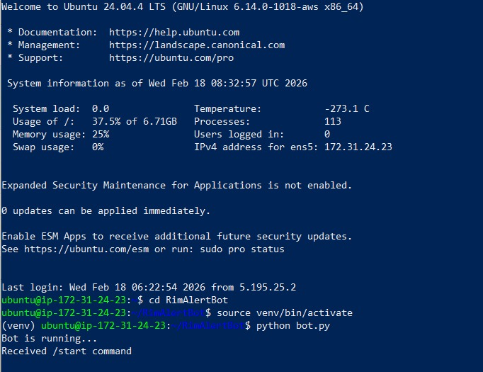
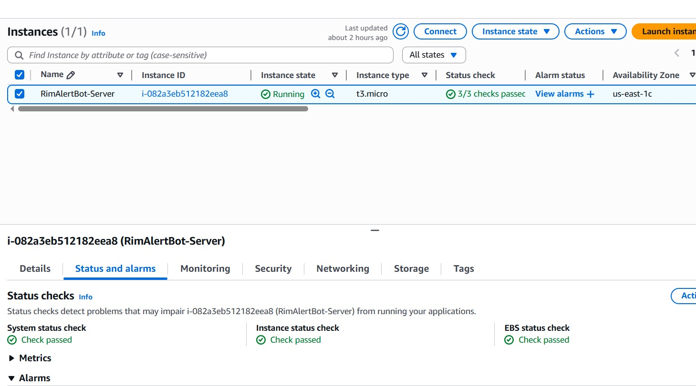
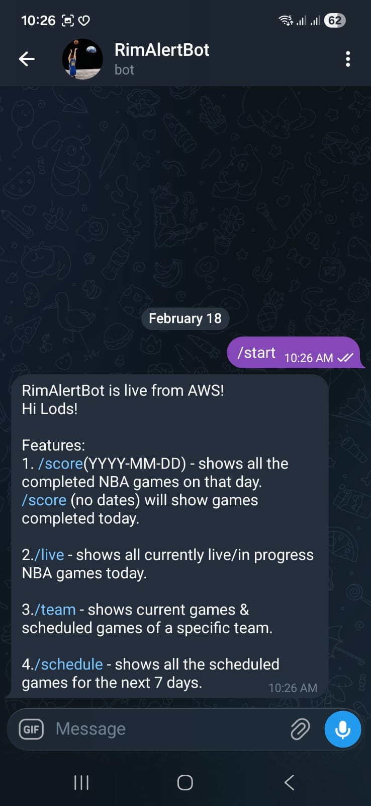
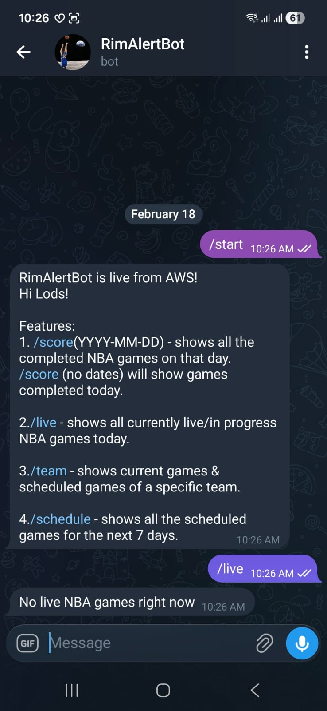
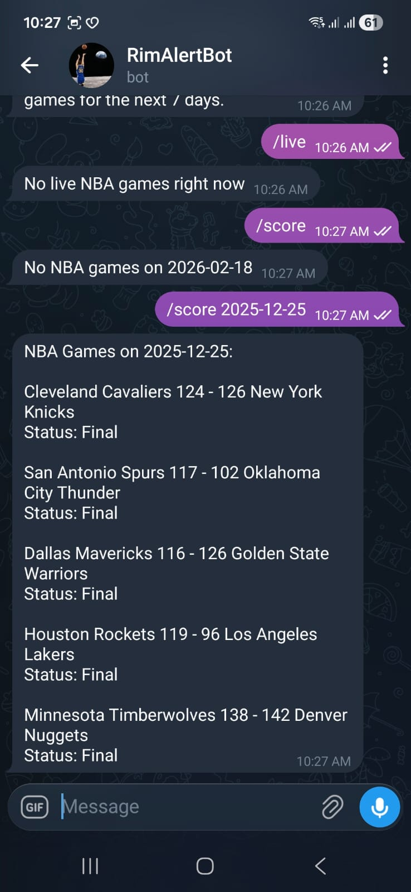
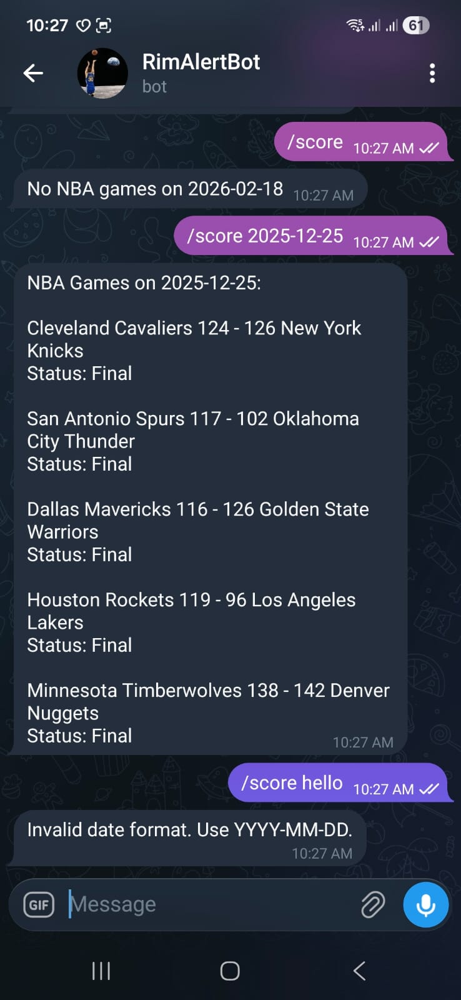
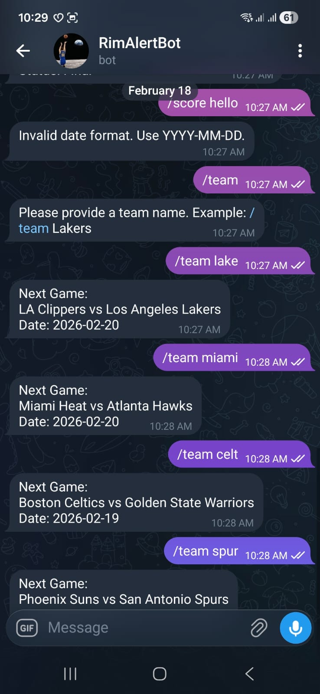
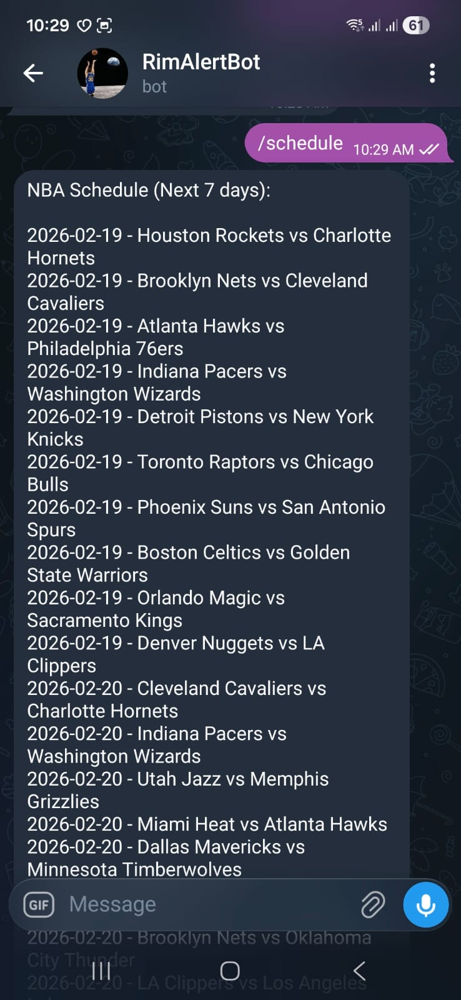

# RimAlertBot

RimAlertBot is a cloud-hosted Telegram bot built with Python and deployed on AWS EC2 (Ubuntu).  
It provides NBA scores, live game updates, team-specific schedules, and upcoming match information using the balldontlie API.

---

## Features

- `/start` – Displays bot information and available commands
- `/score` – Shows completed NBA games today
- `/score YYYY-MM-DD` – Shows completed games for a specific date
- `/live` – Displays currently live NBA games
- `/team <team_name>` – Shows next scheduled game for a specific team
- `/schedule` – Shows NBA schedule for the next 7 days
- Input validation and error handling
- Optimized API usage to reduce unnecessary requests

---

## Architecture

- Telegram User -> RimAlerBot (Python - async) -> balldontlie API -> Telegram Response.

---

## Cloud Deployment

- Hosted on AWS EC2 (Ubuntu 24.04)
- SSH key-based authentication
- Python virtual environment isolation
- Environment variables managed via `.env`
- Manual lifecycle management (start/stop/terminate EC2)
- Integrated third-party REST API (balldontlie)
---

## Screenshots

### Bot Running on AWS EC2


### EC2 Instance Status


### Telegram Bot Features

#### /start Command


#### /live Command


#### /score Command


#### /score Input Validation


#### /team Command


#### /schedule Command


---

## Technical Challenges Solved

- Refactored multi-request team lookup into a single optimized API call
- Implemented ISO date validation
- Handled async command architecture using `python-telegram-bot`
- Managed EC2 lifecycle and server persistence
- Secured API keys using environment variables
- Prevented unnecessary API calls through input validation logic

---

## Installation (Local)

```bash
git clone https://github.com/RDC4321/RimAlertBot.git

cd RimAlertBot

python -m venv venv

pip install -r requirements.txt

Create a .env file in the project root:
BOT_TOKEN=your_telegram_bot_token
BALLDONTLIE_API_KEY=your_api_key

Run the bot:
python bot.py
```
---

## Future Improvements

- Convert to systemd service for automatic restart on crash
- Dockerize deployment
- Add logging and monitoring vis AWS CloudWatch
- Implement webhook-based architecture
- Add user favorites and persistent storage
